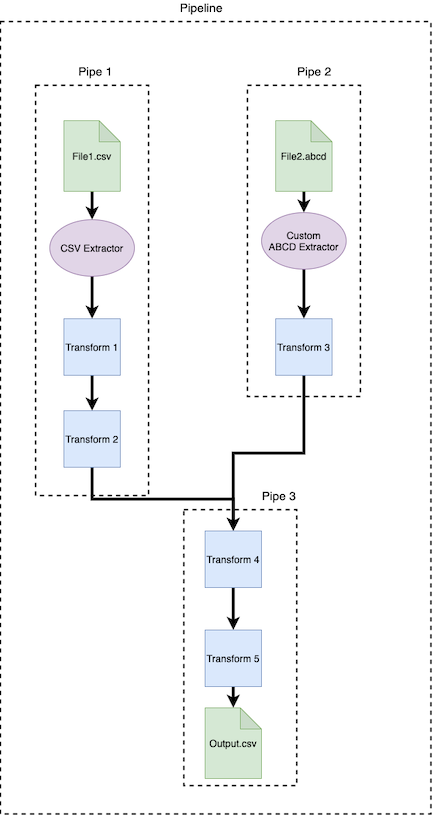

.. _pipes_and_pipelines:

===================
Pipes and Pipelines
===================

Pipes are made up of operators which linearly transform data. Pipelines are made up of Pipes which
can converge and diverge. They represent entire data pipelines. All operators must be wrapped in a Pipe.

Piperoni Pipelining Diagram:



.. _pipes:

Pipes
========

Pipes *can* begin with an :ref:`Extractor <extractors>`, and can contain one or more
:ref:`Transformers <transformers>`. **`Pipes` should represent the transformation of a single file or object.**
All operators must be wrapped in a Pipe. In order to handle multiple files and/or objects, multiple `Pipes` should be combined into a
Pipeline.

Below is an example of a Pipe constructed of a CSVExtractor, and three custom transformers:

.. code-block:: python

   from piperoni.operators.extract.extract_file.csv_ import CSVExtractor
   from my_project.operators import Transformer1, Transformer2, Transformer3
   from piperoni.operators.pipe import Pipe
   import pandas as pd

   my_pipe = Pipe(
      [
         CSVExtractor(),
         Transformer1(),
         Transformer2(),
         Transformer3()
      ],
      name='My pipe'
   )

   final_object = my_pipe("path/to/input.csv")


.. _pipelines:

Pipelines
=========

Pipelines are an optional encapsulation around multiple Pipes and are required for branching
functionality. They represent entire data pipelines of multiple inputs and/or outputs. The Pipeline
object provides functionality to pass outputs of Pipes as inputs to other Pipes, provide caching of
outputs in case of multiple dependence, and providing branching through :ref:`CastOperators <casters>`.

Transforms that connect to a pipeline can either pass a regular data type, or a PipelineData type.
PipelineData is very similar to a dict and can be used as such. Note that if a transform is
splitting its output, it should return a PipelineData object. Also note that a transform
being fed multiple inputs by the Pipeline should expect a PipelineData object as its input type.

Pipeline objects need to be defined using three dicts:

1. ```inputs_dict```, A dict where keys are Pipes and values are strings or a list of strings of unique labels.
2. ```outputs_dict```, A dict where keys are Pipes and values are strings or a list of strings of unique labels.
3. ```raw_inputs```, A dict where keys are Pipes and values are inputs to those Pipes.

You can also visualize your Pipeline with the ```visualize``` method. ```visualize``` has one optional argument, ```full``` (```False``` by default).
If ```full == False```, your visulization will collapse each ```Pipe```, making a more compact visulization. 
If ```full == True```, each operator within each ```Pipe``` will be displayed on the output visulization.

.. code-block:: python

   class PrintOperator(PassthroughOperator):
      def transform(self, input_):
         print(input_)
         return input_


   class IncrementOperator(TransformOperator):
      def transform(self, input_):
         print(f"Received {input_}, passing {input_+1}.")
         return input_ + 1


   class SumOperator(CastOperator):
      @property
      def input_type(self):
         return PipelineData

      @property
      def output_type(self):
         return int

      def transform(self, input_):
         to_sum = list(input_.values())
         print(f"Summing {to_sum}, returning {sum(to_sum)}.")
         return sum(to_sum)


   class OneVsRestSplitOperator(CastOperator):
      def __init__(self, name):
         self.name = name

      @property
      def input_type(self):
         return int

      @property
      def output_type(self):
         return PipelineData

      def transform(self, input_):
         print(f"Received {input_}, splitting into {1} and {input_-1}.")
         return {f"{self.name}_output1": 1, f"{self.name}_output2": input_ - 1}

   pipe1 = Pipe(
      [IncrementOperator(), IncrementOperator(), IncrementOperator()], name="Pipe1")

   pipe2 = Pipe(
      [SumOperator(), IncrementOperator(), OneVsRestSplitOperator("pipe2"),], name="Pipe2",)

   pipe3 = Pipe(
      [SumOperator(), OneVsRestSplitOperator("pipe3")], name="Pipe3")

   # ----------------------------------------

   inputs = {
      pipe1: "pipe1_raw",
      pipe2: ["pipe1_output", "pipe2_raw"],
      pipe3: ["pipe1_output", "pipe2_output1", "pipe3_raw"],
   }

   outputs = {
      pipe1: "pipe1_output",
      pipe2: ["pipe2_output1", "pipe2_output2"],
      pipe3: ["pipe3_output1", "pipe3_output2"],
   }

   raws = {"pipe1_raw": 3, "pipe2_raw": 7, "pipe3_raw": 13}

   pipeline = Pipeline(inputs, outputs, raws)
   pipeline.visualize()
   outputs = pipeline.run()
